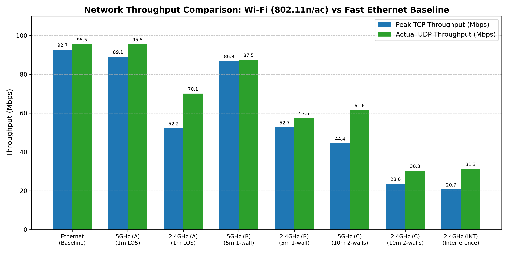
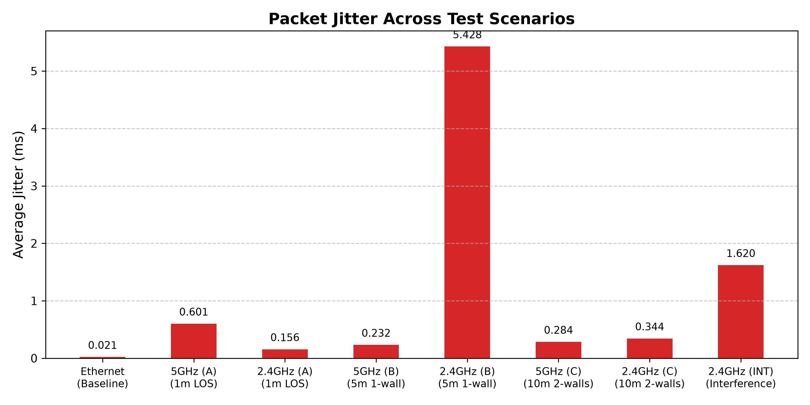

# wifi-vs-ethernet-performance-benchmark
Empirical performance evaluation of 802.11n/ac vs Fast Ethernet using automated iperf3 benchmarks.
# Wi-Fi (802.11n / 802.11ac) vs Fast Ethernet Benchmark

Practical network performance tests comparing 2.4 GHz and 5 GHz Wi-Fi against wired 100BASE-TX Ethernet using `iperf3` on Windows.

## Test Setup
- **Router / AP:** TP-Link Archer C20 v5 (100 Mbps Ethernet ports)
- **Wi-Fi Card:** Realtek 8821AE PCIe (1x1 SISO)
- **Networks tested:**
  - Fast Ethernet (Cat 5e, 100 Mbps Full Duplex)
  - 5 GHz (802.11ac, 80 MHz, ch 44)
  - 2.4 GHz (802.11n, 20/40 MHz, ch 10)

## Test Locations
- **Point A:** 1 meter away, direct line of sight.
- **Point B:** 5 meters away, through 1 interior wall.
- **Point C:** 10 meters away, through 2 walls.
- **Point C + Interference:** 10 meters away with active 2.4 GHz noise (microwave / ISM load).

## Results

| Scenario | Mode | Distance / Conditions | RSSI (dBm) | TCP Throughput | UDP Bandwidth | UDP Loss | Jitter |
| :--- | :--- | :--- | :--- | :--- | :--- | :--- | :--- |
| `ETH_01` | Ethernet | Router LAN port | - | 92.7 Mbps | 95.5 Mbps | 0.02% | 0.02 ms |
| `W50_A` | 5 GHz | 1m, direct LOS | -50 | 89.1 Mbps | 95.5 Mbps | 4.31% | 0.60 ms |
| `W24_A` | 2.4 GHz | 1m, direct LOS | -50 | 52.2 Mbps | 70.1 Mbps | 8.38% | 0.16 ms |
| `W50_B` | 5 GHz | 5m, 1 wall | -50 | 86.9 Mbps | 87.5 Mbps | 11.98% | 0.23 ms |
| `W24_B` | 2.4 GHz | 5m, 1 wall | -50 | 52.7 Mbps | 57.5 Mbps | 0.01% | 5.43 ms |
| `W50_C` | 5 GHz | 10m, 2 walls | -68 | 44.4 Mbps | 61.6 Mbps | 0.32% | 0.28 ms |
| `W24_C` | 2.4 GHz | 10m, 2 walls | -50 | 23.6 Mbps | 30.3 Mbps | 0.01% | 0.34 ms |
| `W24_INT` | 2.4 GHz | 10m, 2 walls + noise | -51.5 | 20.7 Mbps | 31.3 Mbps | 0.00% | 1.62 ms |

## Charts
Generated via `scripts/plot_results.py`:




## Main Takeaways
1. **The 100 Mbps LAN bottleneck:** At Point A, 5 GHz Wi-Fi reached 89.1 Mbps TCP / 95.5 Mbps UDP, practically maxing out the router's 100BASE-TX port. The Wi-Fi link speed was 433 Mbps, but real speeds were limited by the physical Ethernet switch.
2. **Wall penetration:** 5 GHz signal dropped from -50 dBm to -68 dBm after two walls, cutting TCP speed by half (89 -> 44 Mbps). 2.4 GHz signal strength stayed at -50 dBm, but its speed still dropped significantly due to airtime contention.
3. **Interference impact:** 2.4 GHz noise didn't ruin packet loss, but increased jitter up to 1.62 ms (with spikes near 4 ms), slowing TCP down to ~20 Mbps due to CSMA/CA backoff and retransmissions.

## How to Run
1. Tests automated via batch scripts in `scripts/run_benchmarks.bat`.
2. Raw logs are saved in `data/raw_logs/`.
3. To regenerate plots:
   ```bash
   pip install matplotlib numpy
   python scripts/plot_results.py
